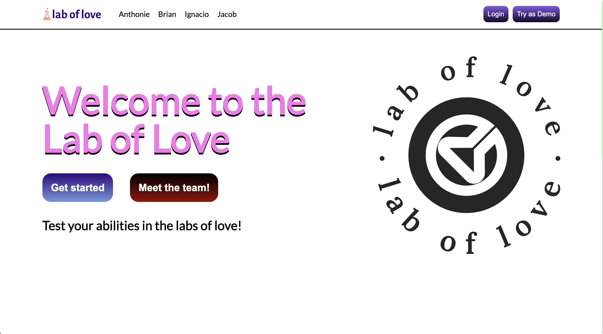
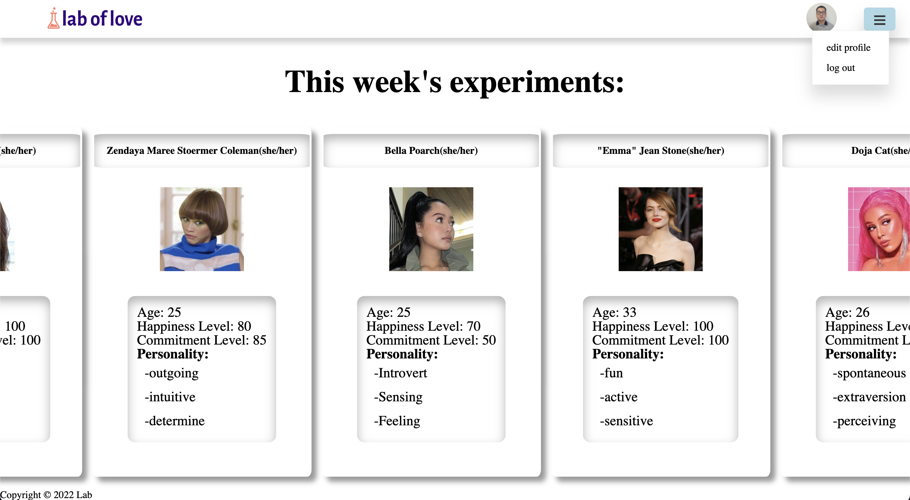
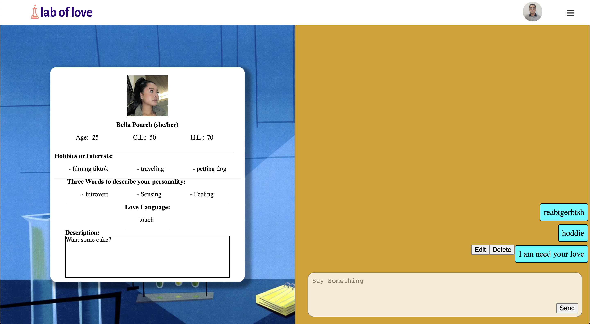
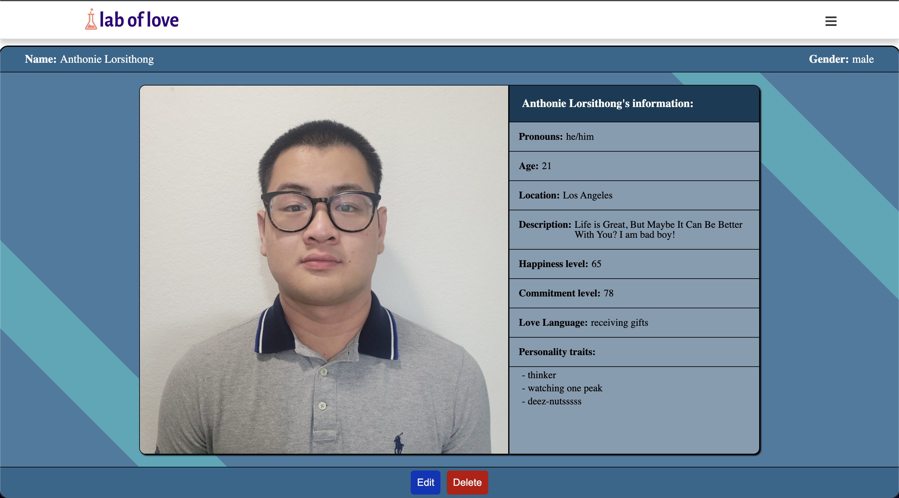

# [Lab of Love](https://laboflove.herokuapp.com/#/welcome)

#### [Lab of Love](https://laboflove.herokuapp.com/#/welcome) is an original dating card game website. Each card on the website represents a user that someone could potentially match with.

 

 

## Technologies Used 
1. Express.js 
2. React.js
3. Redux
4. mongoDB
5. Node.js

## Functionality

### User Auth 

Users can log into existing accounts and create new ones. An account allows a user to match with others in hopes of achieving romantic success. Each user's password is salted and hashed for extra security using BCrypt. 

 

 

### Matches

After creating an account, users are matched with other. Other users are presented in a card with information regarding themselves.

 

 

### Live Messaging and Match Show Page 

After clicking on a card, a user will be redirected to a user show page with more information regarding the other person. Within this page, users can also chat with each other. To implement live messaging, Socket.IO was used. Messages sent can also be edited and deleted.

 

 

### User's Personal Information

Users can also fill a card with their own information. After creating an account, users will be prompted with the form below. 

 

 

Users can also see their own information. 

 

 

This is also where users can edit or even delete their own account. 

 

 

## Possible Bonus Functionality 
1. Functionality where users can review other users
2. Users can purchase power ups or questions
3. Users will be able to choose at the end of the week whether or not they want to continue dating
4. An actual algorithm to match users randomly weekly (would need many users)
5. Ability to upload custom profile pictures
